# 马士兵教育 · 咚宝商城

## 准备

你需要在本地安装 node 和 git。

### Node.js 安装配置

我们以 Node.js v14.15.1 LTS版本为例。
Node.js 安装包及源码下载地址为：<https://nodejs.org/en/download/>。

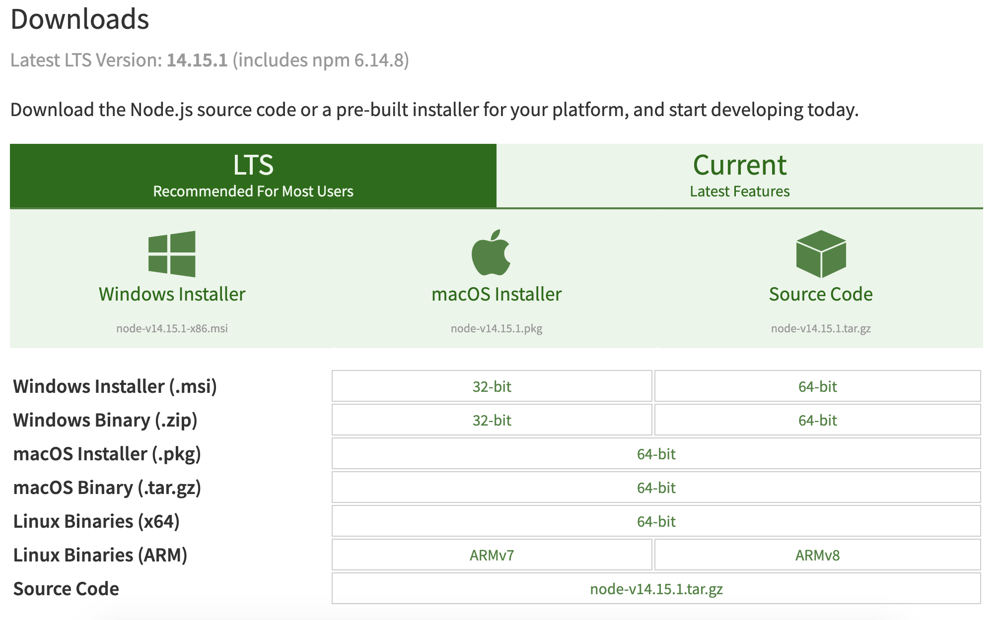

你可以根据不同平台系统选择你需要的 Node.js 安装包。

### Windows 上安装 Node.js

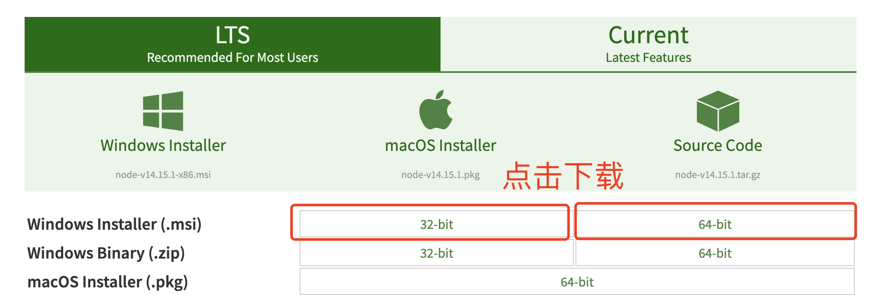
32 位系统请点击第一个， 64 位系统请点击第二个

步骤 1 : 双击下载后的安装包

步骤 2 : 点击以上的Run(运行)

步骤 3 : 勾选接受协议选项，点击 next（下一步） 按钮

步骤 4 : 点击 next（下一步）

步骤 5 : 点击树形图标来选择你需要的安装模式 , 然后点击下一步 next（下一步）

步骤 6 :点击 Install（安装） 开始安装Node.js。

步骤 7 :点击 Finish（完成）按钮退出安装向导。

打开终端，输入`node -v`，显示出版本号代表安装成功

### Mac OS 上安装

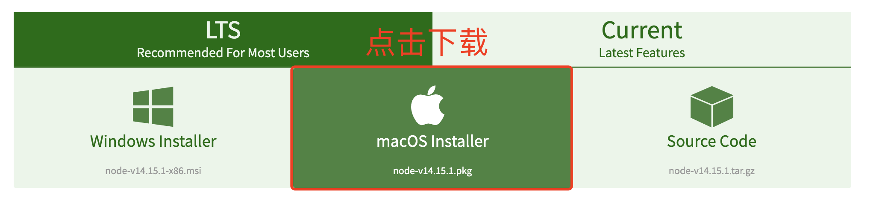

步骤 1 : 双击下载后的安装包
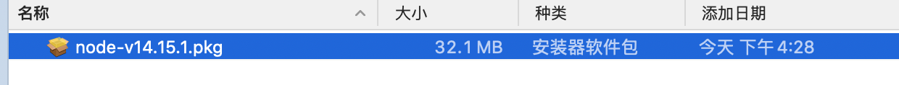

步骤 2 : 点击继续
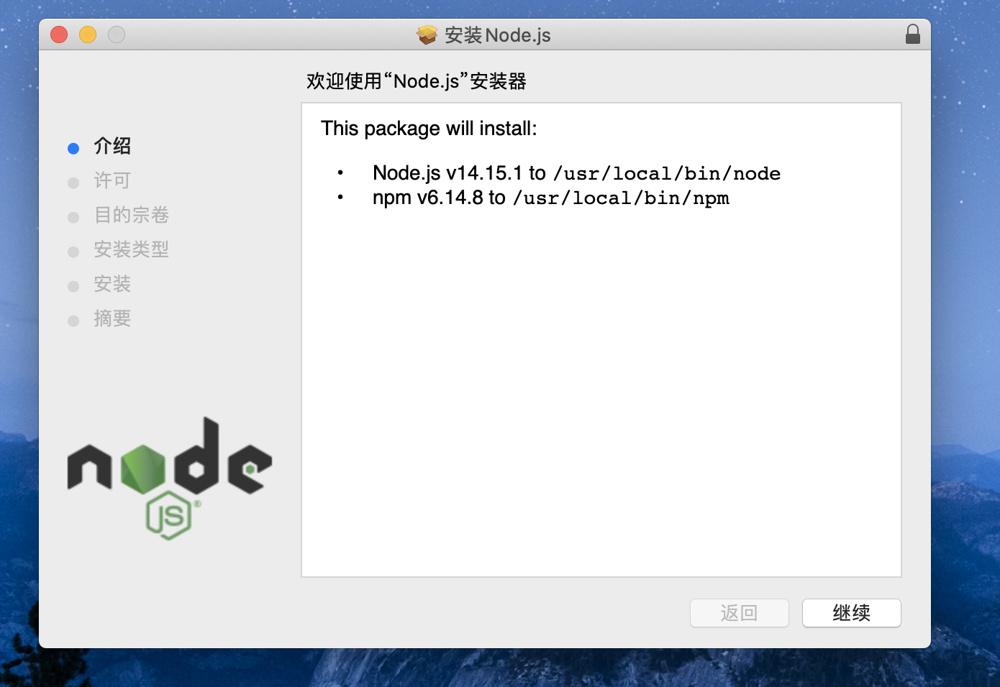

步骤 3 : 点击继续
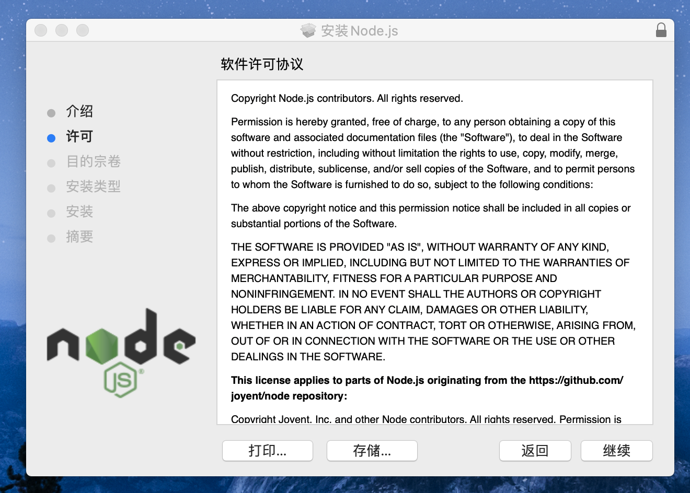

步骤 4 : 点击同意
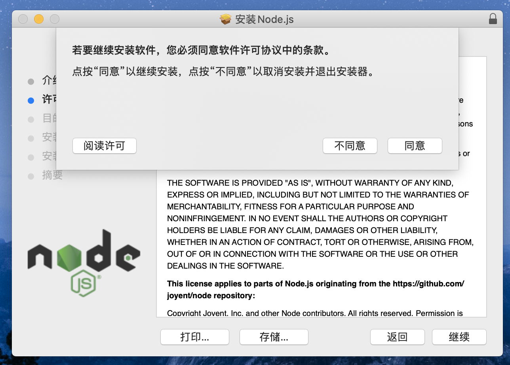

步骤 5 : 点击继续
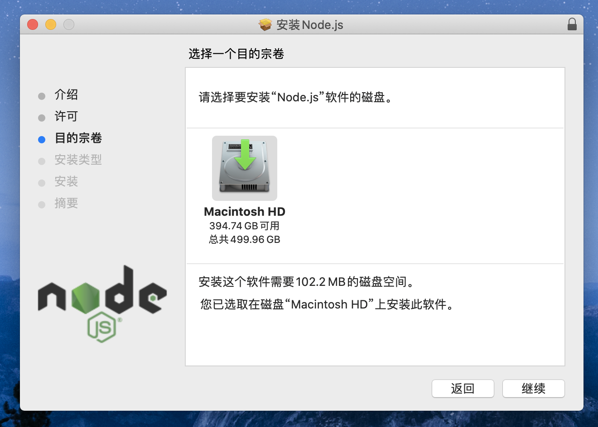

步骤 6 : 点击安装
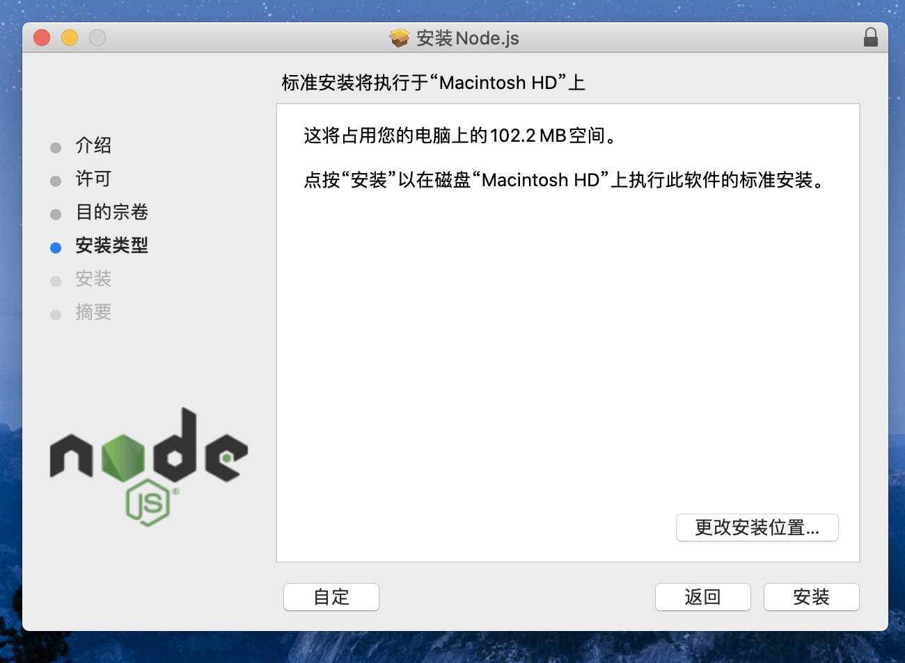

步骤 7 : 安装成功，点击关闭
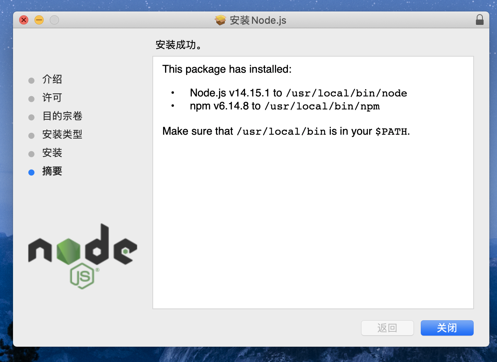

打开终端，输入`node -v`，显示出版本号代表安装成功
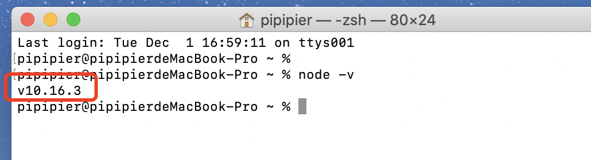

## 启动项目

```sh
# 克隆项目
git clone http://39.98.86.13/architecture-group/msb-dongbao-mall-portal-view.git

# 进入项目目录
cd msb-dongbao-mall-portal-view.git

# 安装依赖
npm install

# 启动服务
npm run dev
```

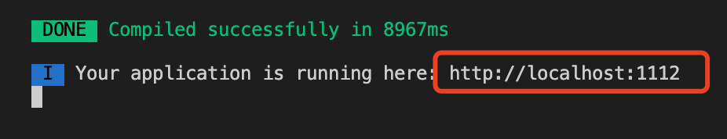
浏览器访问图中所示链接

## 目录结构

```sh
├── build                      # 构建相关
├── config                     # 配置相关
├── static                     # 静态资源
├── src                        # 源代码
│   ├── api                    # 所有请求
│   ├── components             # 全局公用组件
│   ├── router                 # 路由
│   ├── store                  # 全局 store管理
│   ├── styles                 # 全局样式
│   ├── utils                  # 全局公用方法
│   ├── views                  # views 所有页面
│   ├── App.vue                # 入口页面
│   ├── main.js                # 入口文件 加载组件 初始化等
├── .eslintrc.js               # eslint 配置项
├── .babelrc                   # babel-loader 配置
└── package.json               # package.json
```
